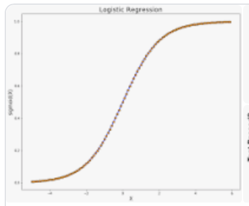

# Model Analysis and notes

## Multiclass vs Multilable
- In a **Multiclass** classification only one output can be True.
- In a **Multilable** classification one or more than one outputs can be true.

## Term frequency
- tf(i,d) - Frequency for term (or n-gram) 't' in the document 'd'

- The number of times that a term is present.

```tf = (Number of times term t appears in a document)/(Total number of terms in the document)```

## Term frequency - inverse document frequency
- For document search and information retrieval. 

- It works by increasing proportionally to the number of times a word appears in a document, but is offset by the number of documents that contain the word. **So, words that are common in every document, such as "this", "what", "and" "if", rank low even though they may appear many times, since they don’t mean much to that document in particular**.

- TF-IDF allows us to give give more importance to those terms that are frequent in the current document, but not in all the documents.

### Applications of TF-IDF
- Information retrival
- Keyword extraction
- Help sort data into categories

```Text vectorization transforms text within documents into numbers, so TF-IDF algorithms can rank articles in order of relevance.```


## Onehot encoding
- **TfidfVectorizer:** 
Transforms text to feature vectors that can be used as input to estimator.

> TF-IDF are word frequency scores that try to highlight words that are more interesting, e.g. frequent in a document but not across documents. The TfidfVectorizer will tokenize documents, learn the vocabulary and inverse document frequency weightings, and allow you to encode new documents.

- **MultilabelBinarizer (for multilabel classification):**
> Multilabelbinarizer allows you to encode multiple labels per instance. To translate the resulting array, you could build a DataFrame with this array and the encoded classes

## Multi-Label Classification Technique:
### OneVsRestClassifier
- In an “one-to-rest” strategy, one could build multiple independent classifiers and, for an unseen instance, choose the class for which the confidence is maximized.
- The main assumption here is that the labels are mutually exclusive. You do not consider any underlying correlation between the classes in this method.

## ML MODELS
### SGDClassifier (Stockastic Gradient Descent Classifier)
- It is a linear classifier used to find the minima of the function.
-  It is a simple and efficient approach for discriminative learning of linear classifiers under convex loss functions.

> Stochastic - Random ; Gradient - slope ;Descent - downwards

- Basically, this technique is used as an "optimizing algorithm" for finding the parameters with minimal convex loss/cost function.

### Logistic Regression
- Logistic regression models the probabilities for classification problems with two possible outcomes. It's an extension of the linear regression model for classification problems



> Using the solver 'lbfgs' to handle multinomial loss for Multilabel classification problem

### LinearSVC (Support Vector Classifier)
- Objective of a Linear SVC (Support Vector Classifier) is to fit to the data you provide, returning a "best fit" hyperplane that divides, or categorizes, your data. 


## Model Performance metric
### Jaccard similarity/index
Size of intersection of the predicted labels and the true labels divided by the size of union of the predicted and true labels. Ranges from 0 to 1, 1 being the perfect score


<hr/>

## Python Function wiki
ast -> literal evaluation (Converts the string into list data)
lambda function-> iterates over each row and performs a specific operation


