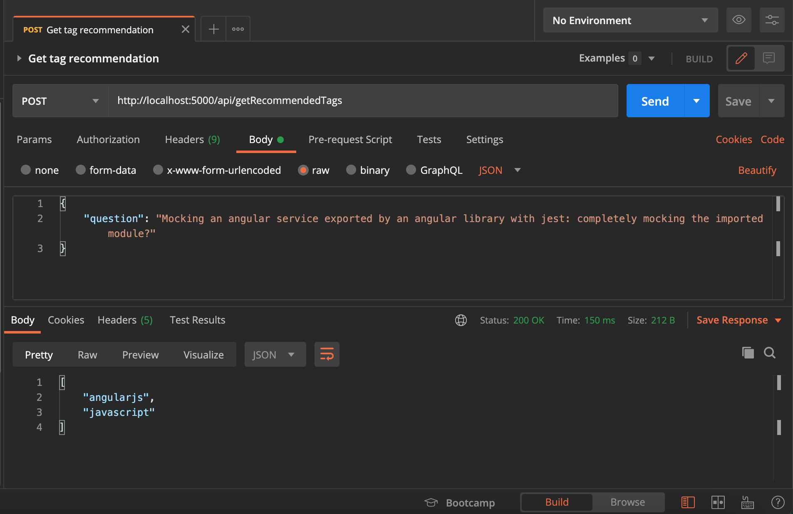
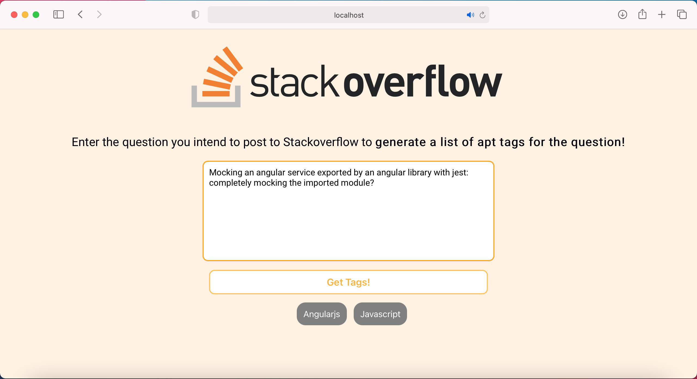

# Stackoverflow Tag Prediction

A Machine learning based project to predict the appropriate tags for any question that you intend to ask on stackoverflow using a **Multilable Text classification algorithm**.

For more information on the model click [here](MODEL.md)


## Project Setup

1. Clone GitHub repository.

```
cd Stackoverflow-Tag-Prediction
```

2. Download all dependencies by running
```
pip3 install -r requirements.txt
```
3. Run flask server
```
python3 main.py
```


## Using the API
Endpoint: **/api/getRecommendedTags**



## Using the react frontend

### 1. Build the react-frontend

Run the following commands

- ```cd client```
- ```npm run build```
- ```cd ..```
- ```python3 main.py```

Once the server is up and running, visit **localhost:5000** through your browser

</img>

## Contributing
Pull requests are welcome. For major changes, please open an issue first to discuss what you would like to change.

Please make sure to update tests as appropriate.

## License
[MIT](https://choosealicense.com/licenses/mit/)